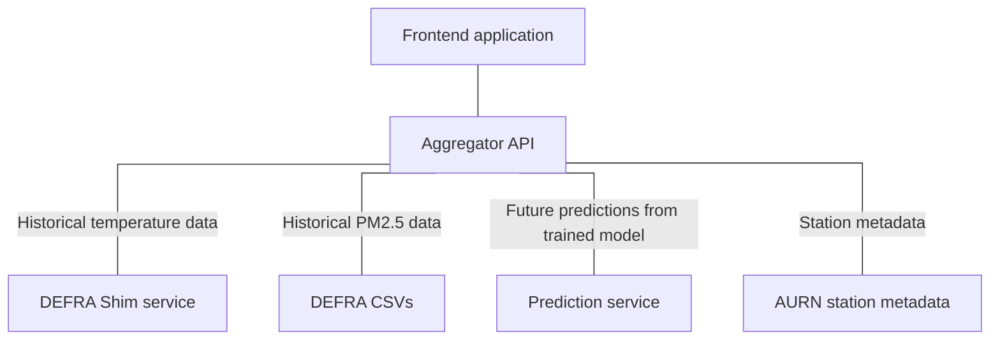

# COMP3000 Project - Backend API

## Navigation

- [Frontend](https://github.com/Lewis-Trowbridge/COMP3000-Project-Frontend)
- Aggregator (you are here)
- [Predictions](https://github.com/Lewis-Trowbridge/COMP3000-Project-Machine-Learning)
- [Metadata](https://github.com/Lewis-Trowbridge/COMP3000-DEFRA-To-Mongo)
- [Shim](https://github.com/Lewis-Trowbridge/COMP3000-Project-DEFRA-Shim)
