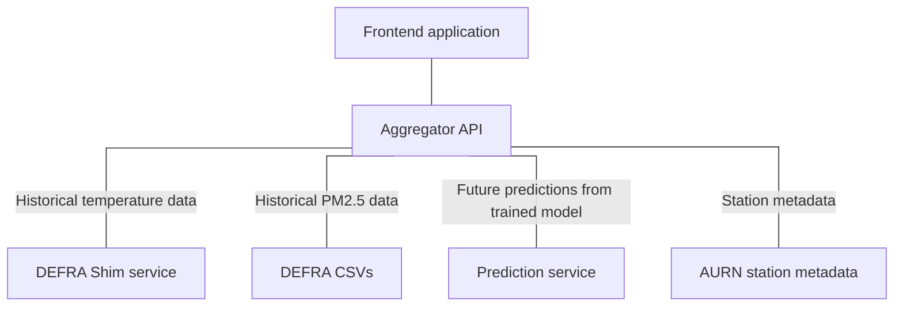

# COMP3000 Project - Backend API

## What is this?

This repository contains an aggregator REST API for multiple other services for air quality and temperature data in the UK, intended to be paired with the frontend. This service is responsible for making calls and formatting responses from these other services, making them easy to digest for the frontend.

## Navigation

- [Frontend](https://github.com/Lewis-Trowbridge/COMP3000-Project-Frontend)
- Aggregator (you are here)
- [Predictions](https://github.com/Lewis-Trowbridge/COMP3000-Project-Machine-Learning)
- [Metadata](https://github.com/Lewis-Trowbridge/COMP3000-DEFRA-To-Mongo)
- [Shim](https://github.com/Lewis-Trowbridge/COMP3000-Project-DEFRA-Shim)

## How is it made?

This service uses C#'s ASP.NET framework to provide a REST API for obtaining environmental data. Some key points of the implementation are:

- Service makes use of the MVC and strategy patterns
- Service uses "Service" classes to perform heavy-duty work, while controllers handle coordination of request details
- Integration and functional tests are performed using an in-memory MongoDB instance

