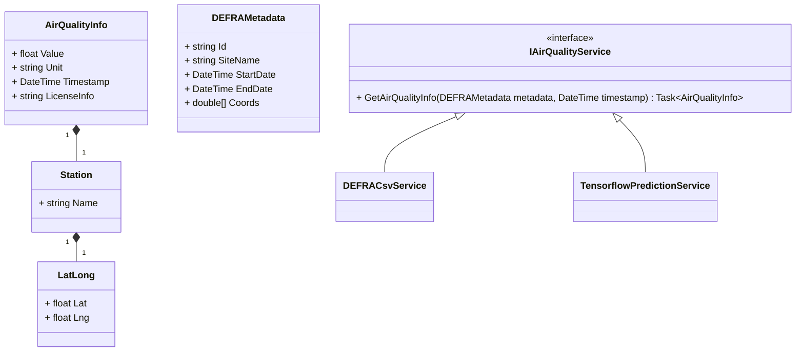

```mermaid
classDiagram
    class AirQualityInfo {
        + float Value
        + string Unit
        + DateTime Timestamp
        + string LicenseInfo
    }

    class Station {
        + string Name
    }

    class LatLong {
        + float Lat
        + float Lng
    }

    Station "1" *-- "1" LatLong
    AirQualityInfo "1" *-- "1" Station
    
    class DEFRAMetadata {
        + string Id
        + string SiteName
        + DateTime StartDate
        + DateTime EndDate
        + double[] Coords
    }

    class IAirQualityService {
        + GetAirQualityInfo(DEFRAMetadata metadata, DateTime timestamp) Task~AirQualityInfo~
    }
    <<interface>> IAirQualityService

    class DEFRACsvService {

    }

    class TensorflowPredictionService

    IAirQualityService <|-- DEFRACsvService
    IAirQualityService <|-- TensorflowPredictionService
```
