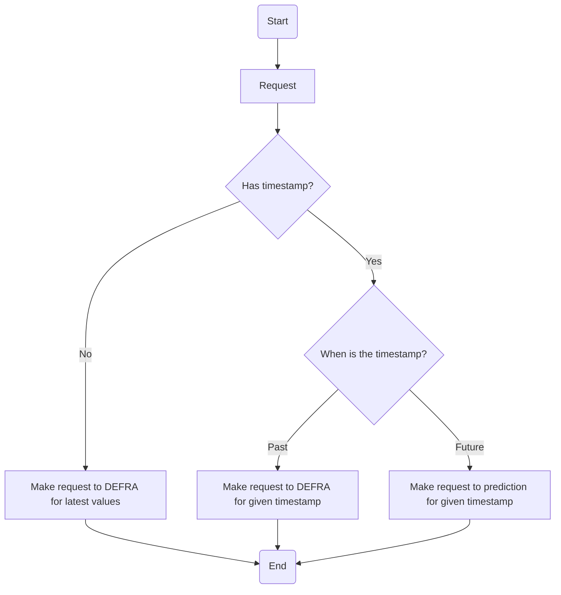

```mermaid
graph
direction TB
Start(Start)
End(End)
A[Request]
B{Has timestamp?}
C1[Make request to DEFRA for latest values]
C2{When is the timestamp?}
D1[Make request to DEFRA for given timestamp]
D2[Make request to prediction for given timestamp]

Start --> A
A --> B
B -->|No| C1
B --> |Yes| C2
C2 --> |Past| D1
C2 --> |Future| D2
C1 --> End
D1 --> End
D2 --> End
```
